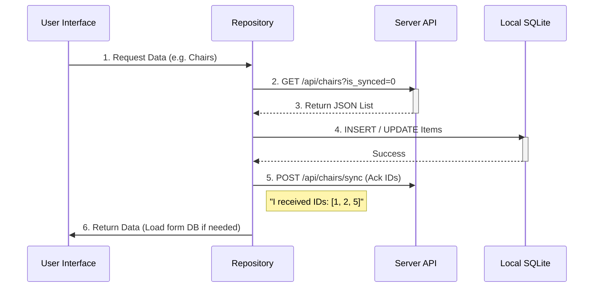
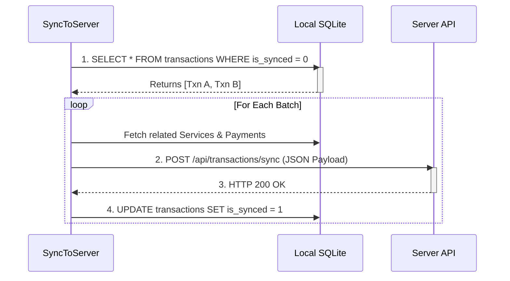
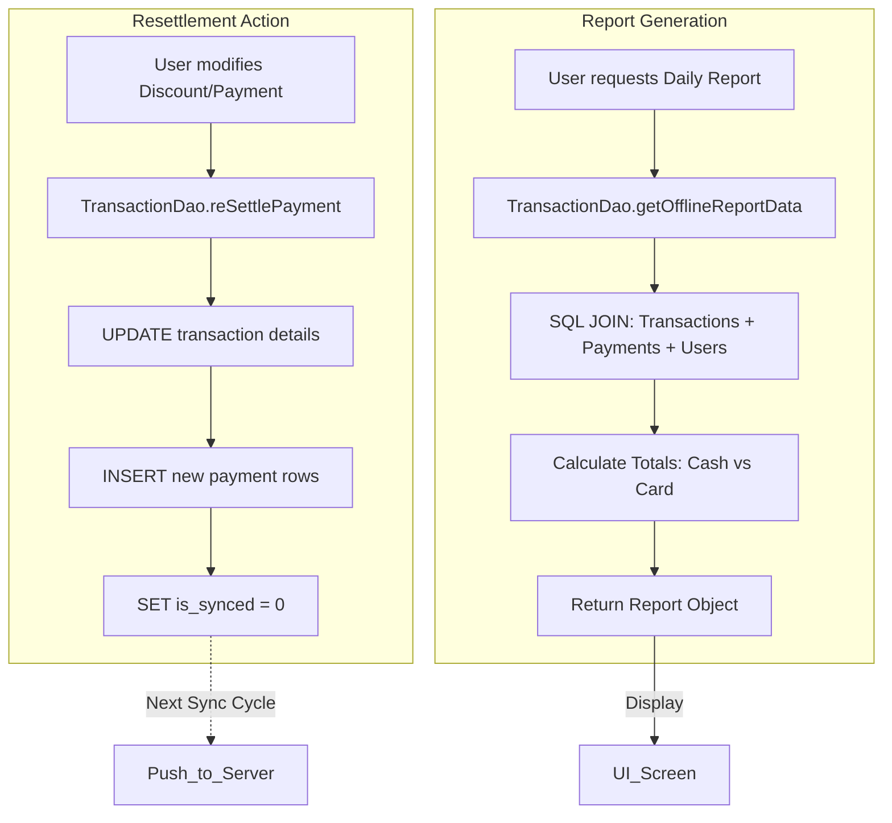
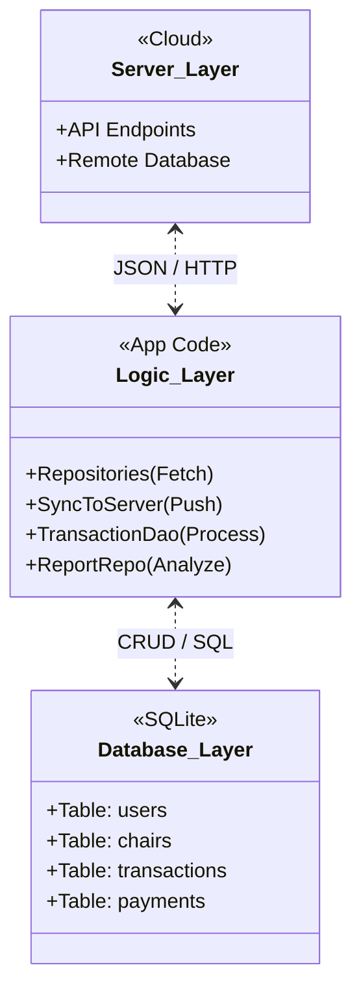

# Project Architecture & Data Flow

## 1. System Overview

The system optimizes for **Offline Availability** using a local SQLite database as the primary data source for the UI. Synchronization with the server is event-driven and periodic.

| Component              | Technology         | Responsibility                                         |
| :--------------------- | :----------------- | :----------------------------------------------------- |
| **Server**             | REST API           | Central Authority, Cloud Storage, Authentication.      |
| **Mobile App (Logic)** | Dart/Flutter       | Business Rules, Sync Orchestration, API Communication. |
| **Local Database**     | SQLite (`sqflite`) | Offline Cache, Transaction Storage, Reporting Source.  |
| **UI**                 | Flutter Widgets    | Displays data _only_ from Local DB (Read Model).       |

---

## 2. Database Structure (Local SQLite)

| Table Name             | Description                | Key Fields                                     | Sync Strategy             |
| :--------------------- | :------------------------- | :--------------------------------------------- | :------------------------ |
| `users`                | Staff & Admin login info   | `id`, `role`, `password`, `is_synced`          | **Pull Only** (Auth)      |
| `chairs`               | Salon chairs configuration | `id`, `shop_id`, `live_status`                 | **Pull Only** (Ref Data)  |
| `services`             | Service menu & pricing     | `id`, `charge`, `tax_option`                   | **Pull Only** (Ref Data)  |
| `transactions`         | **CORE**: Bookings & Sales | `id`, `status`, `final_total`, `is_synced`     | **Push & Pull** (Two-way) |
| `transaction_payments` | Payment breakdown          | `transaction_id`, `mode` (Cash/Card), `amount` | **Push** (Child of Txn)   |
| `cash_registers`       | Shift/Day tracking         | `id`, `opened_at`, `closed_at`, `is_synced`    | **Push** (Up-Sync)        |

---

## 3. Detailed Data Flows

### A. Data Pull (Down-Sync)

- **Trigger**: App Start, Manual Refresh, or Navigation to Home.
- **Action**: Fetch data from API $\rightarrow$ Save to DB $\rightarrow$ Send Acknowledgment.



### B. Data Push (Up-Sync)

- **Trigger**: Timer, Manual Sync Button, or End of Transaction.
- **Logic**: `SyncToServer` checks for dirty records (`is_synced = 0`).



### C. Resettlement & Reporting

- **Resettlement**: Modifying a past transaction.
- **Reporting**: Generating views from local data.



---

## 4. Architecture Swimlane Diagram

This diagram aligns the components side-by-side to show responsibilities clearly.



```mermaid
graph TD
    %% Define Swimlanes using Subgraphs
    subgraph Server_Lane [SERVER (Cloud)]
        direction TB
        API_Get[GET Data endpoint]
        API_Post[POST Sync endpoint]
    end

    subgraph Logic_Lane [APP LOGIC (Dart)]
        direction TB
        Repo[Repository Layer]
        SyncMgr[Sync Manager]
        Resettle[Resettlement Logic]
    end

    subgraph DB_Lane [LOCAL DB (SQLite)]
        direction TB
        Table_Ref[Ref Data: Chairs/Services]
        Table_Txn[Txn Data: Bookings/Payments]
    end

    %% Flows

    %% Pull
    API_Get ==JSON==> Repo
    Repo --Save--> Table_Ref
    Repo --Ack IDs--> API_Post

    %% Push
    Table_Txn --Unsynced Records--> SyncMgr
    SyncMgr --Batch Upload--> API_Post
    SyncMgr --Mark Synced--> Table_Txn

    %% Interact
    Resettle --Update & Reset Sync Flag--> Table_Txn
```
